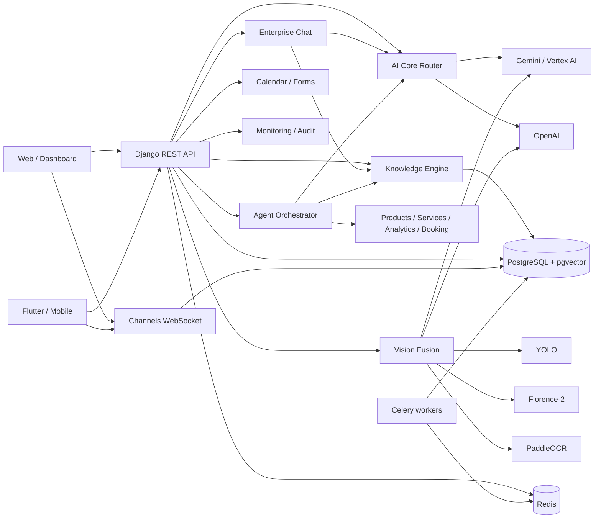

# Architecture Twinscopes AI Enterprise

## Vue générale

## Applications ajoutées

### `apps.ai_core`

Responsabilités : sélection du fournisseur, fallback, exécution texte/vision/embedding, journalisation, agrégation quotidienne et tests de santé.

Modèles principaux :

- `AIProviderConfiguration`
- `AIRun`
- `AIUsageDaily`

### `apps.knowledge`

Responsabilités : ingestion de sites/documents/FAQ/produits/services, découpage, embeddings, recherche vectorielle et synchronisation Celery.

Modèles principaux :

- `KnowledgeSource`
- `KnowledgeDocument`
- `KnowledgeChunk`
- `FAQItem`
- `ServiceOffering`

Sécurité crawler : protocoles HTTP(S) uniquement, résolution DNS, blocage des réseaux privés/loopback/link-local/réservés, validation de chaque redirection et limites de pages/temps.

### `apps.vision_ai`

Responsabilités : création de perspectives depuis une image 360, exécution des fournisseurs activés, fusion des résultats, détections, OCR et mise à jour de la scène.

Modèles principaux :

- `VisionAnalysis`
- `VisionFrame`
- `VisionDetection`
- `OCRTextBlock`

### `apps.ai_agents`

Types inclus : website, product, service, vision, social, booking, CRM, recommendation et analytics.

Chaque agent dispose d’un prompt système, d’outils autorisés, de guardrails, d’un modèle, d’une mémoire et d’un historique d’exécution.

### `apps.ai_chat`

Le chat construit un contexte RAG vérifié, conserve les citations, valide les URL générées et peut utiliser le contexte de la visite et de la scène 360.

Canaux : REST et WebSocket Channels.

### `apps.integrations`

Responsabilités : connexions chiffrées, calendriers, événements Google Calendar, fichiers ICS, formulaires dynamiques et soumissions.

### `apps.monitoring`

Responsabilités : request ID, temps serveur, événements système, audit, santé de PostgreSQL/Redis/fournisseurs et tableau de bord.

## Isolation multi-tenant

Toutes les API Enterprise authentifiées filtrent les données par organisation active de l’utilisateur. Les relations croisées sont validées lors de la création et de la modification : scène/tour/agent/conversation/formulaire ne peuvent pas pointer vers une autre organisation.

## Files Celery

- File par défaut : tâches historiques et métier.
- File `ai` : analyses Vision, indexation RAG et orchestration d’agents.

Le worker `ai_worker` peut être dimensionné ou déployé séparément selon la charge GPU/CPU.
